# empirical_github
## An example of using github to develop portfolio analysis and fama macbeth regression
- Imagine there were three students who were developing a project of portfolio analysis and fama macbeth regression. 
  - Student 1 was the leader of the group, who was responsible for the main branch and the merging of the whole programme. 
  - Student 2 was responsible for the branch of portfolio analysis.
  - Student 3 was responsible for the branch of Fama-Macbeth regression.
- The whole process could be divided to 4 part as follow.
### Main branch
- Student 1 searched for the data which can be used by port-anal and FM regression. He or she created a repository named "empirical_github" like this.

	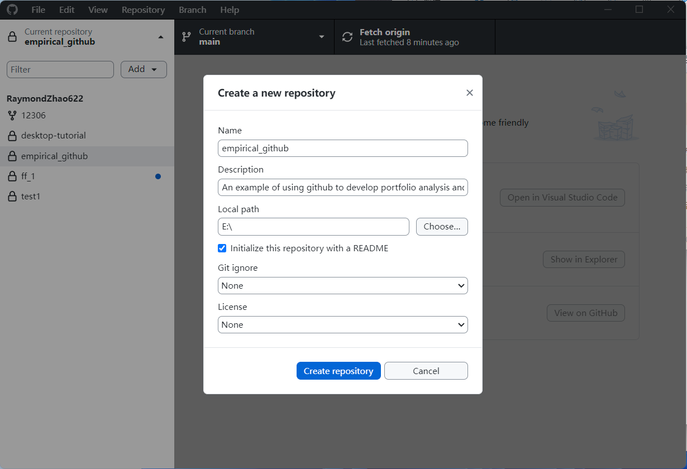

- After finishing the work, student 1 committed the change and pushed it to github.

	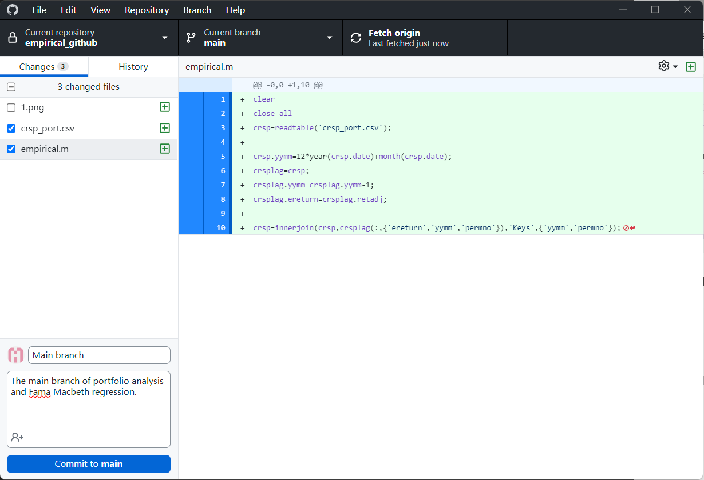

### The branch of portfolio analysis
- After student 1 finished his work, student 2 forked the repository, cloned the repository, created a new branch, and published the branch to continue on his work.

	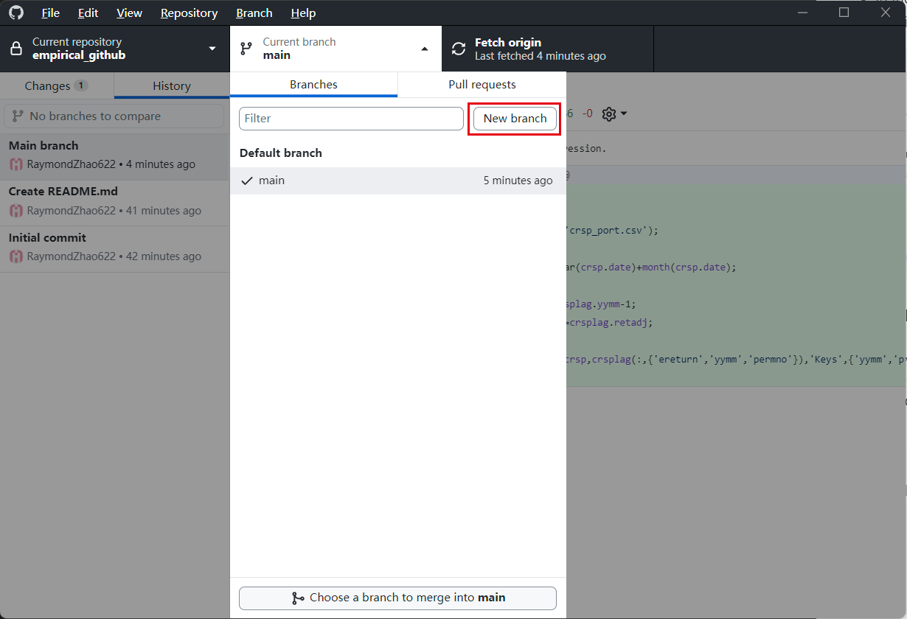
    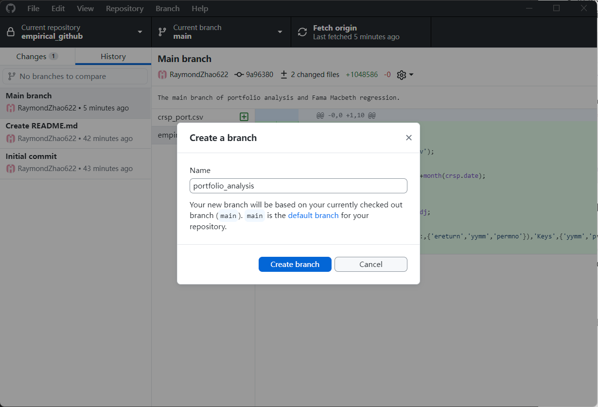
    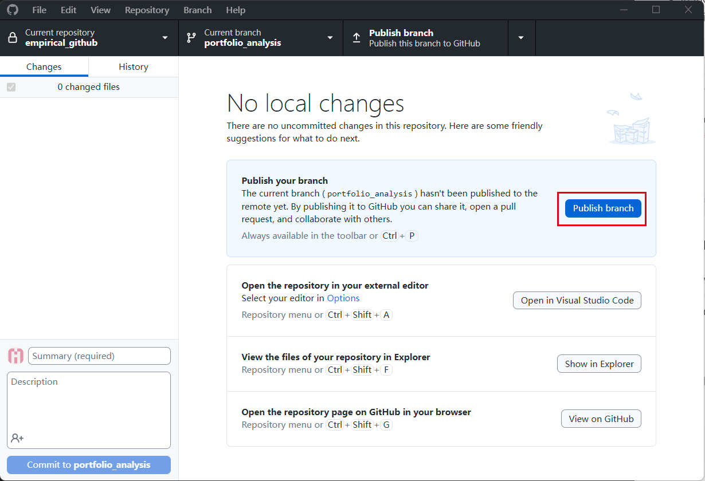

- In this branch, student 2 developed the code of portfolio analysis , and also added some functions and files.
- Then, student 2 commited the changes, pushed it to the website, and then created a pull request to ask student 1 to merge it to the main branch.

	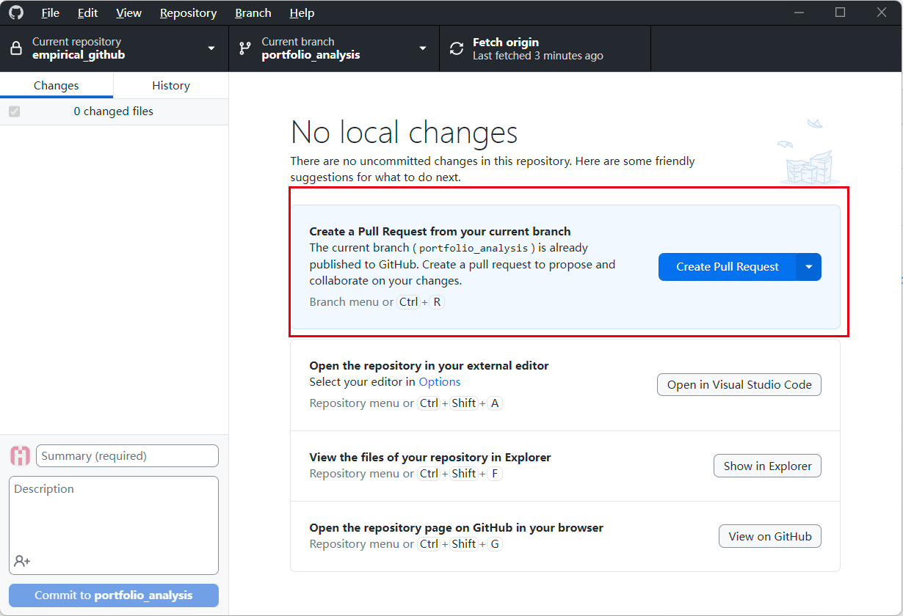
    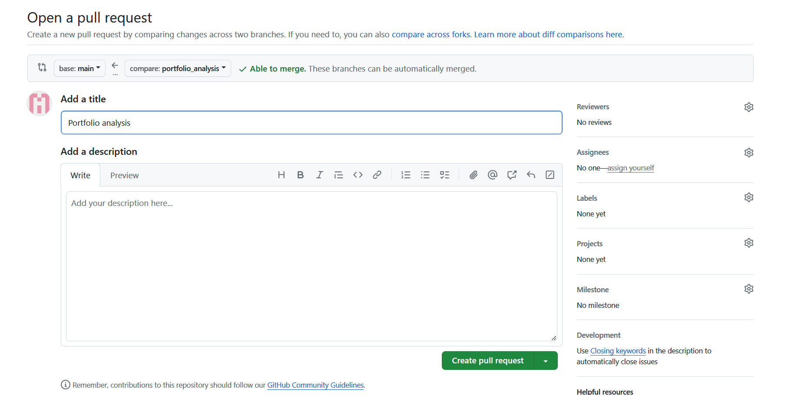

### The branch of fama macbeth regression
- Student 3 worked at the same time. He also forked the repository, cloned it, and created a new branch. Remember, he also developed the code based on the main branch.

- Then, student 3 commited the changes, pushed it to the website, and then created a pull request to ask student 1 to merge it to the main branch.

### Merging
- Now, student 1 received 2 Pull requests. First, he checked the pull request from student 2, and then accepted it.

	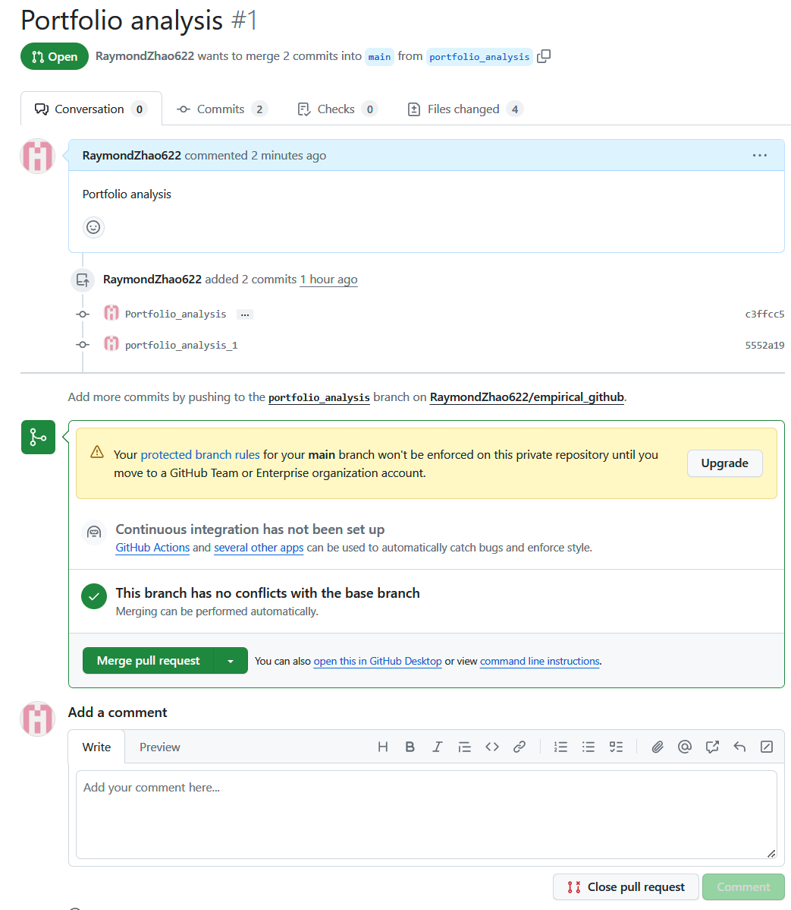

	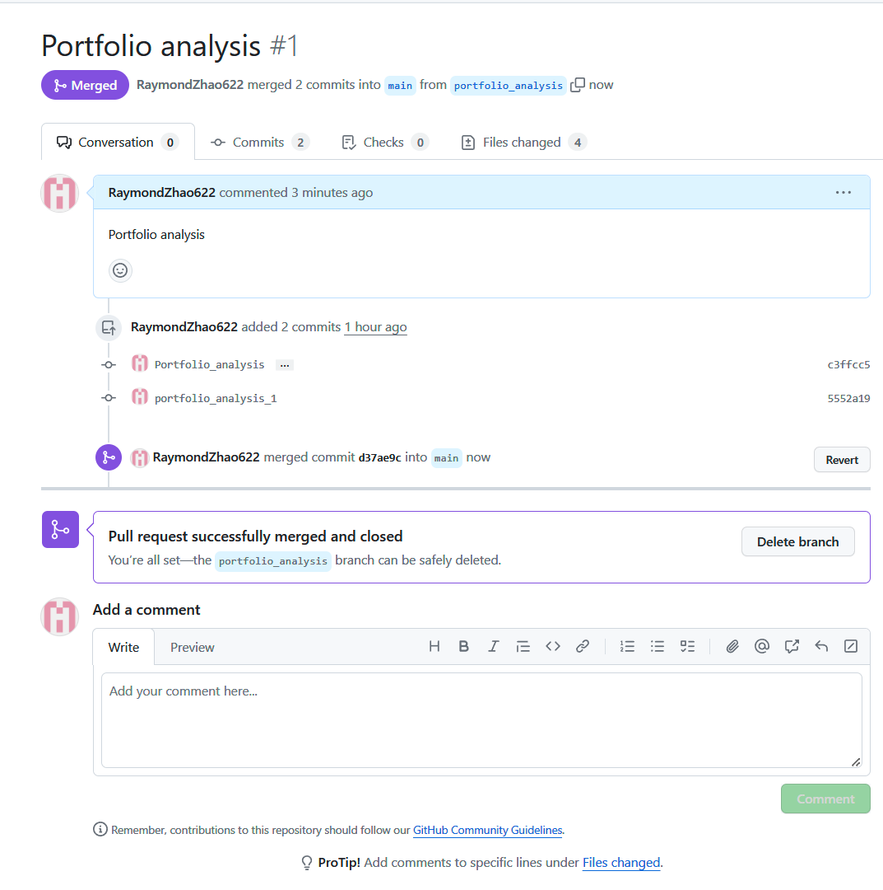

- However, when student 1 was about to accept student 3's pull request, he found that there were some conflicts between the pull request and the main branch now, because the main branch changed after he accepted the first pull request. In this case, student 1 needed to resolve the conflict, and then committed merge.
- If you want to avoid the problem of this conflict, the two students should develop their branches completely seperately. This requires the group leader to do a good job of division of labor to avoid two team members developing a single program at the same time.

	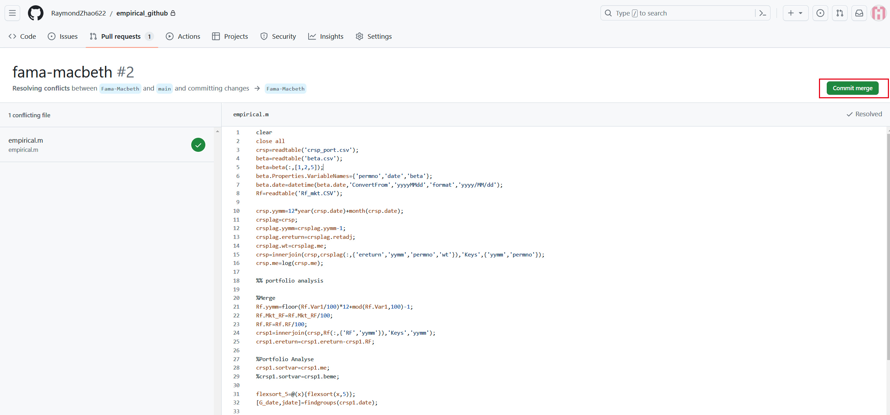

### Conclusion
- The whole process can be summarized as shown in the figure below

	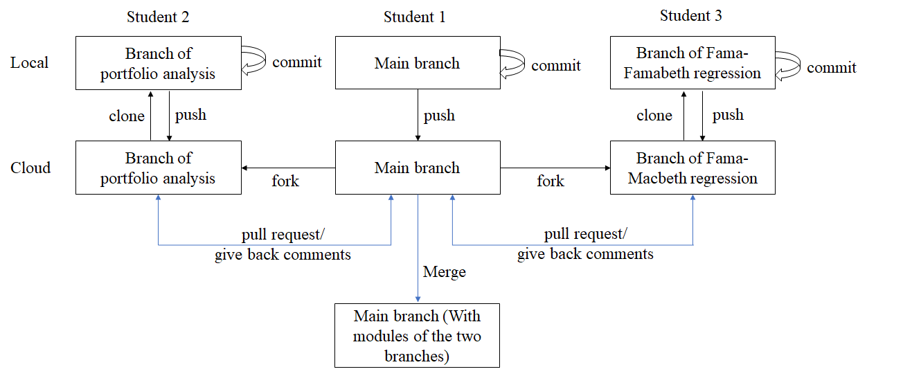

### Q&A
- Q1: Unable to log into github successfully / cannot pull, push, or fetch.
- A1: Need to check your network. Remember, because github is blocked by the GFW, you need to use some specific methods to access the website.
- Q2: Unable to upload / push big files to github.com.
- A2: Github is designed to manage codes, so upload files are limited to 25M (web side) / 100M (desktop side). If you do need to upload large files, you can refer to using Git LFS. In general, you can use wechat or email to share large files with team members, without uploading large files to github.